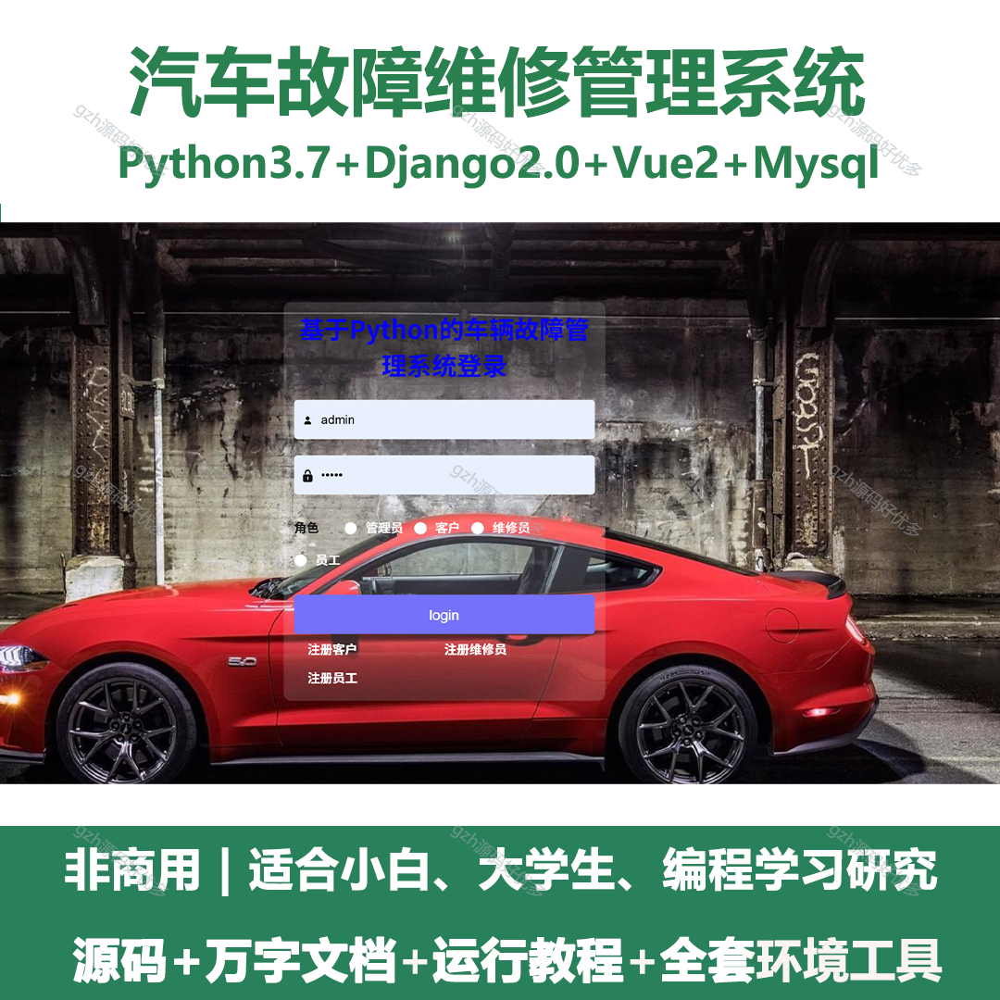
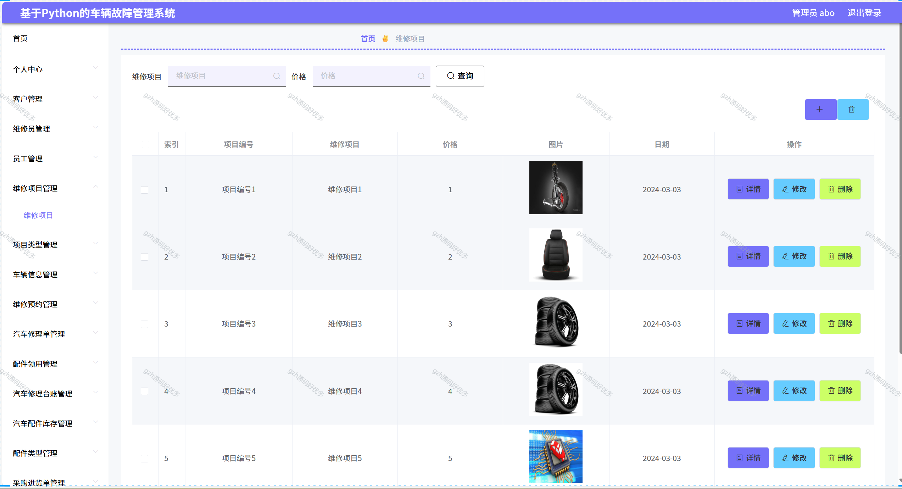
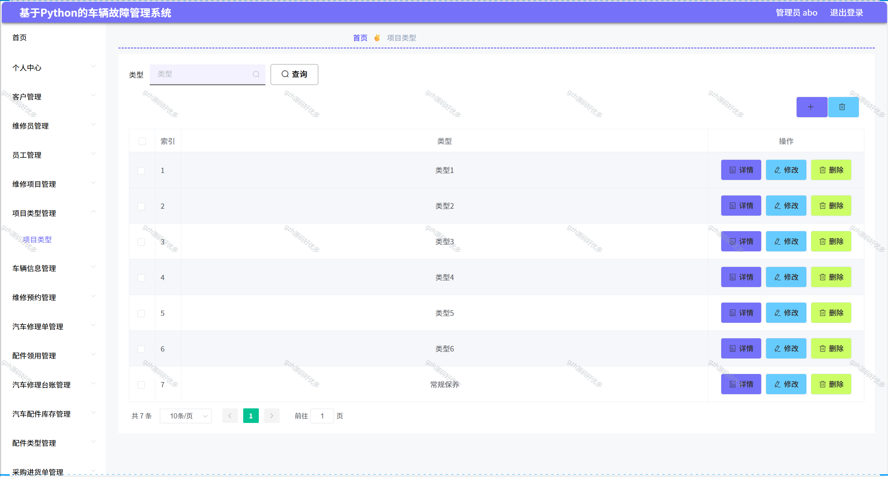
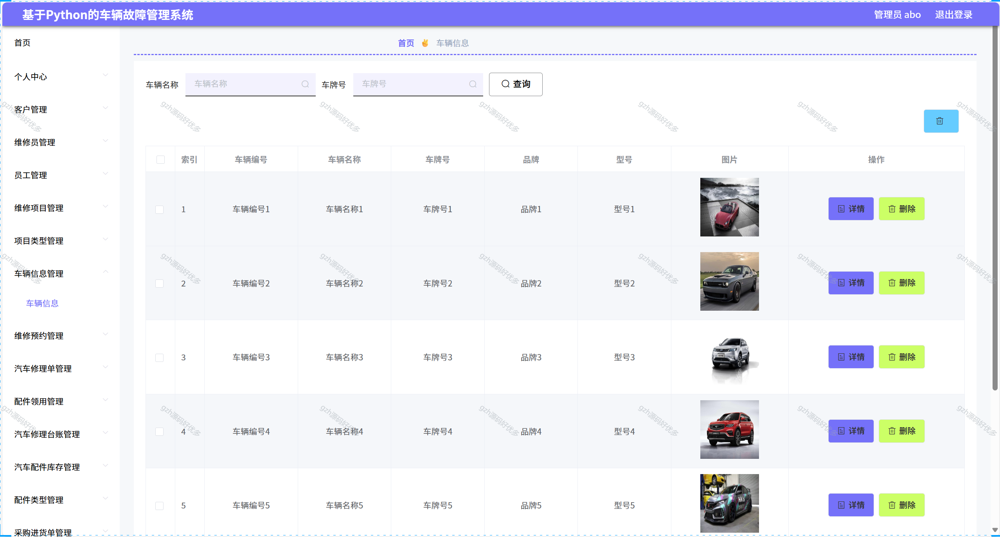
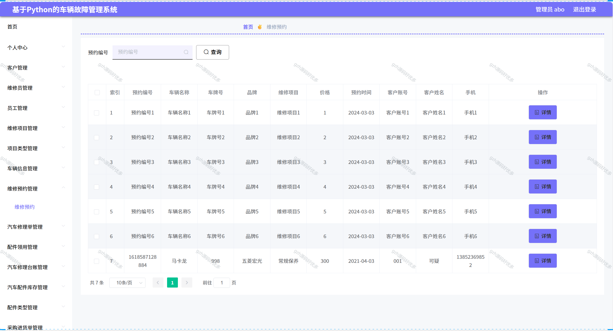
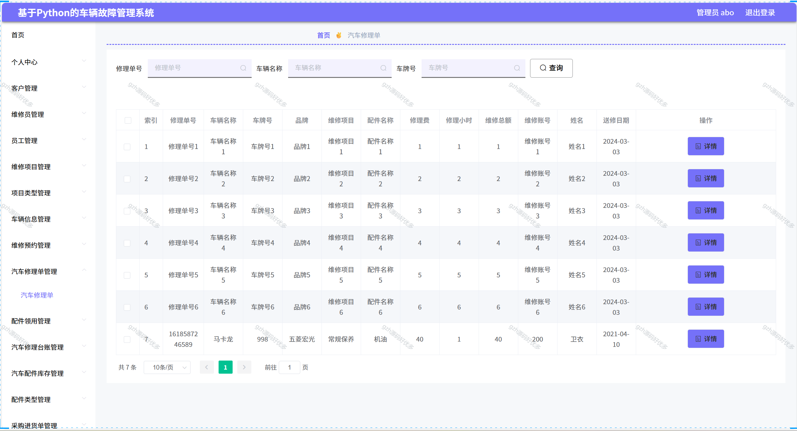
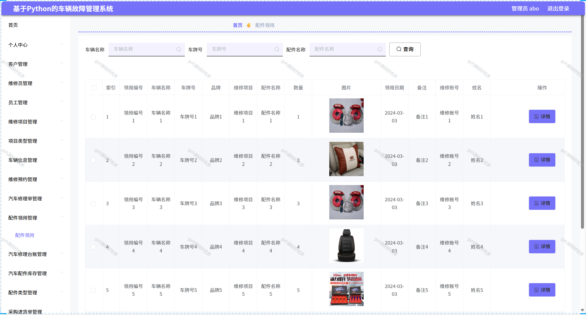
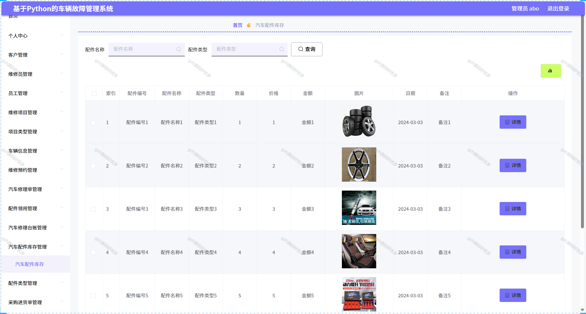
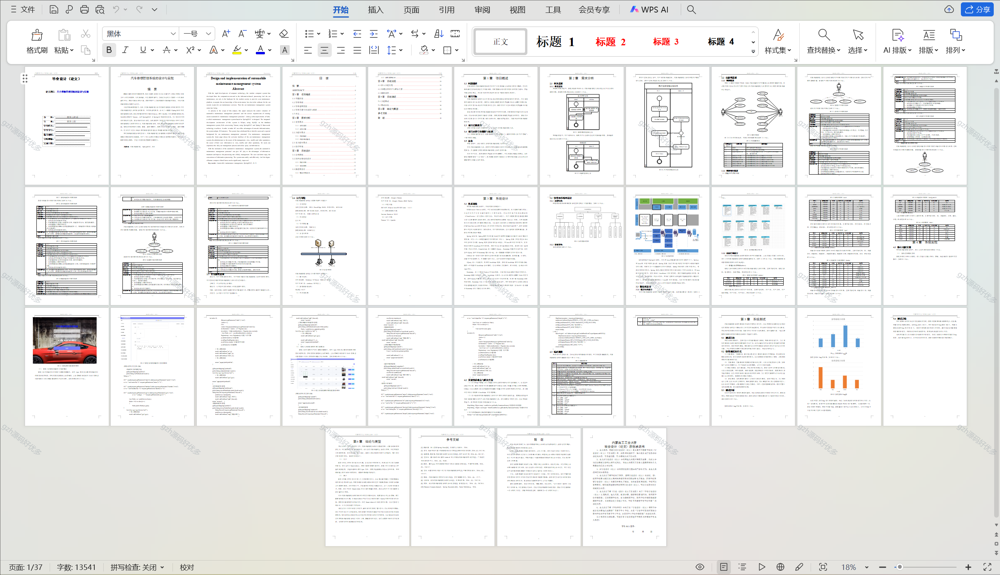

# python060
python060基于Python+Django的汽车故障维修管理系统+LW
 
## 查看主页获取源码

### 一、关键词
汽车维修故障管理系统，车辆维修故障处理系统，机动车故障维修管理平台

### 二、作品包含
源码+数据库+万字文档+全套环境和工具资源+本地部署教程

### 三、项目技术
前端技术：Vue2.0、Element-ui
后端技术：Python3.7、Django2.0

### 四、运行环境（以下版本亲测，其他版本未知，请自测）
开发工具：PyCharm + VSCODE

数据库：MySQL5.7（最低要5.7版本）

数据库管理工具：Navicat10+

Python：Python3.7

前端Nodejs：14

浏览器：谷歌浏览器

### 五、项目介绍
项目编号：python060

汽车维修，不仅需要在硬件上为现代社会的人们提供一个汽车维修的平台，获取汽车知识的环境，更要在软件上为车辆提供汽车维修的服务。于是汽车维修管理系统便应运而生。
系统具有专门的供用户使用的前台和专门供汽车维修管理人员使用的后台。汽车维修管理系统，首页展示汽车维修管理系统的欢迎界面，管理员对车辆进行管理、查看、修改等操作，车辆对自己信息进行查看、修改等操作，对于用户而言可体验日常汽车管理的流程以及在线查询汽车的信息。

### 六、运行截图

